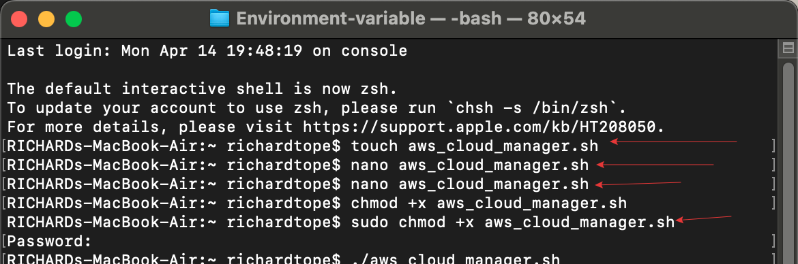
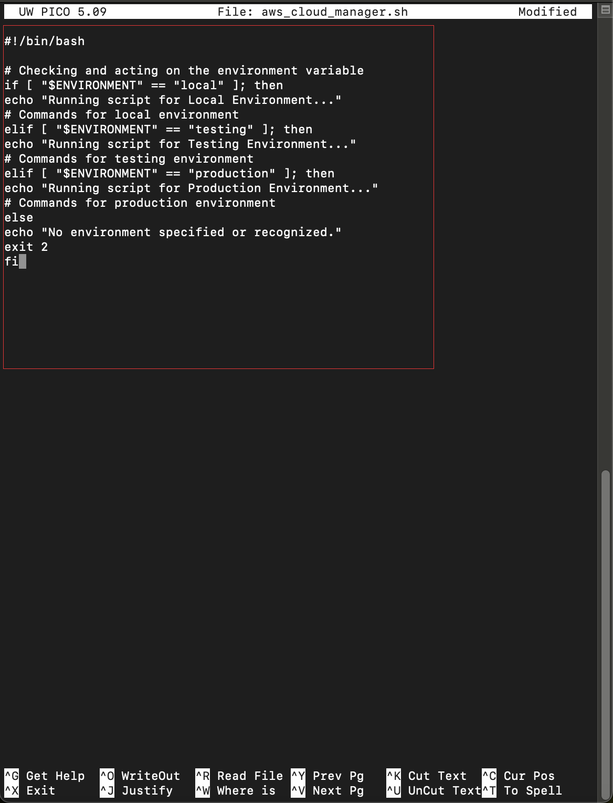
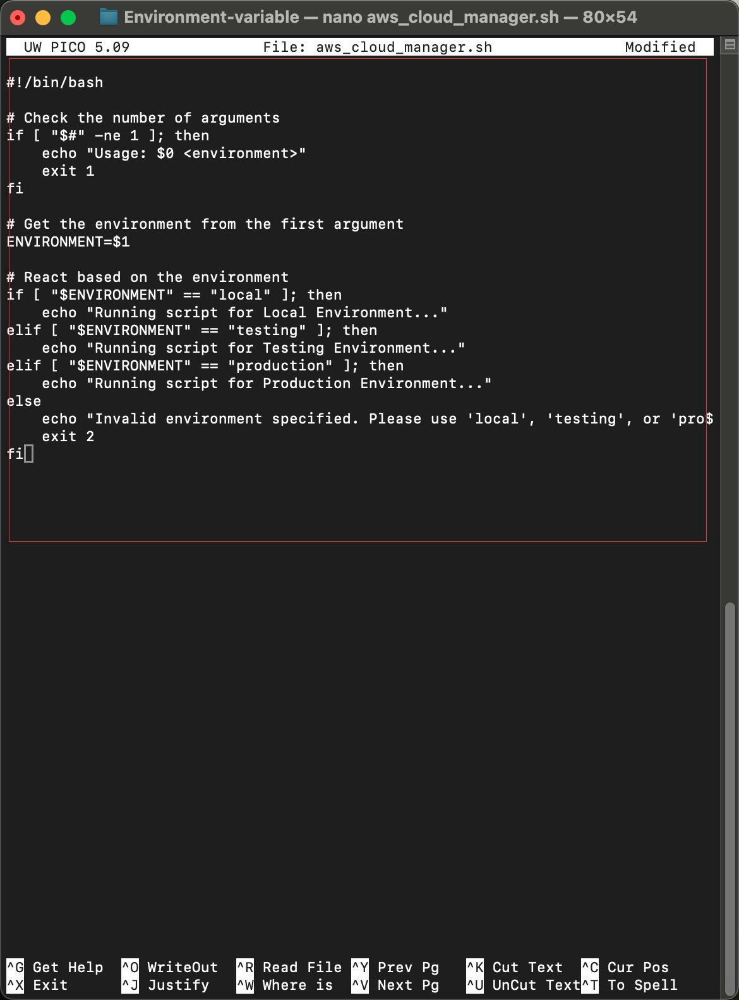
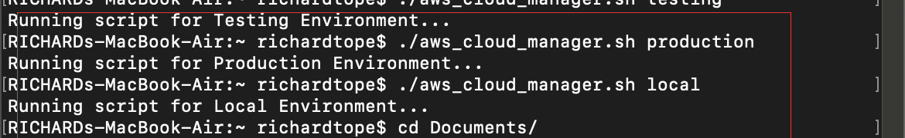

# Environment-variable
This explain the learning from my mini project

# Environment-variable
This explains the learning from my mini project.

**Effective Environment Management with Scripts**

### **Dynamic Environment Management**

1. Dynamically adjusts behavior based on the specified environment, such as local, testing, or production.

   

2. Used to specify the environment and execute environment-specific commands.

   

3. Passed to the script to specify the environment and execute commands.

   

### **Best Practices for Robust Scripting**

4. Ensures the script is robust and adaptable by validating the number of arguments passed.

   

5. Verifies the inputs passed to the script to prevent errors and ensure reliability.

   

### **Practical Example of Environment Management**

6. The examples demonstrate how to manage configurations across environments effectively.

   

7. The use of environment variables and command-line arguments promotes script adaptability and reduces the need for hardcoding values.

   